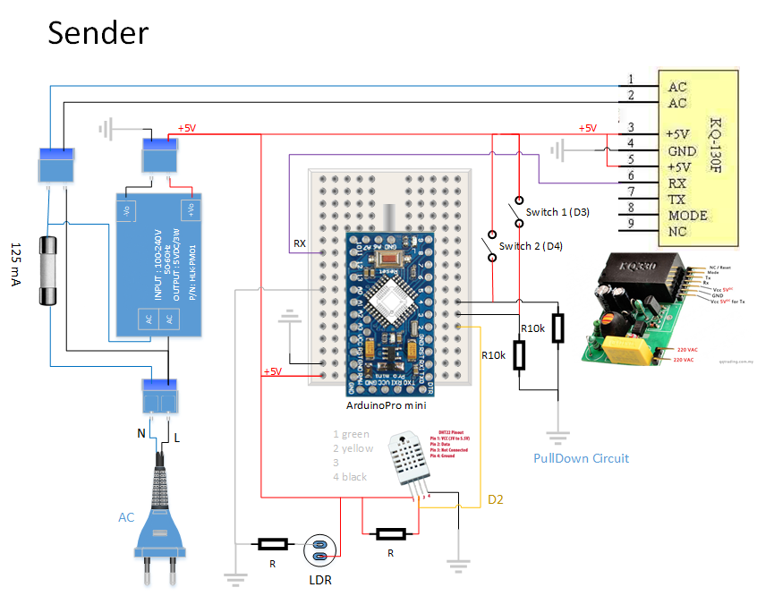

Garage Sensor Node via Power Line Modem
=======================================

This project realizes sending UART serial protocol data via power line, the sender being an Arduino board, the receiver is a Raspberry Pi with a Python program which publishes to MQTT.  

## Challenge
The challenge has been to send data (e.g., temperature sensor readings) from an outside garage to a server (RasPi) inside the main house. 
The gerage is located some distance away from the house and multiple concrete walls are blocking the line of sight, making radio communication impossible.  
But, there is one single phased power line between the house and the garage. Just the power line, no empty conduit.  

## Solution Approach
The solution approach is to use the power line as  carrier. 
A power line modem is used to send sensor readings periodically over the power line.  

The involved components:  
* Arduino Pro mini as sender
  * `garagenode_sender/garagenode_sender.ino`
* Raspberry Pi 2a as receiver
  * `garagenode_receiver/garagenode_receiver_mqtt.py`
* 2 power line modems, KQ-330F (KQ-330), UART

Schematics:  
`SENSORS <---> Arduino <---> Modem <-- Power line --> Modem <---> Raspberry Pi`

## Prerequisites
* Arduino Board, e.g. Arduino Pro Mini
* Arduino Libraries:
  * SoftwareSerial (included in Arduino SDK)
  * DHT, https://github.com/adafruit/DHT-sensor-library
  * Deep sleep, https://github.com/n0m1/Sleep_n0m1
* Python 3.5+
  * Install needed libraries with `pip3 install -r requirements.txt`
* MQTT Server

## Setup

### Software Setup Sender
1. Setup wiring on RasPi, refer to wiring library documentation.
2. Install neccessary Arduino libraries, see above and `garagenode_sender/garagenode_sender.ino`.
3. Upload `garagenode_sender/garagenode_sender.ino` to Arduino board.
   1. Open in Arduino IDE
   2. Select Tools > Arduino Pro Mini, Processor ATmega328P 5V 16 Mhz
   3. Compile 
   5. Click on upload and in the very next second
   5. Reset Arduino by pressing button (or shortly connecting RST+GND)
4. Plug into power line.

### Software Setup Receiver
0. Preparation:
   * Setup MQTT server
  
1. Hardware Setup
   | RasPi      | KQ330 Powerline Modem |
   | ---------- | --------------------- |
   | +5 VCC     | VCC |
   | GND        | GND |
   | RXD = Pin 10 = WiringPi 16 = GPIO 15       | TX  |

2. Install Python libraries with `pip3 install -r requirements.txt`

3. `python garagenode_receiver/garagenode_receiver_mqtt.py /dev/ttyAMA0 9600` 
   This assumes a MQTT server on localhost. If not, then look at the CLI parameters (`--help`).

#### Receiver Autostart (systemd)
A systemd-service-script is located in `garagenode_receiver/systemd/garagenode.service`.  
For install, copy to `/etc/systemd/system` and enable with `systemctl enable garagenode.service`.

### Hardware Wiring

  

The sender has:
* Fuse 125 mA
* KQ-330F, sender pin is RX (!), connected to Arduino D11
* DHT22, Arduino D2
* LDR, Arduino A0
* Reed switch, Arduino D3

  

The receiver has:
* Fuse 125 mA
* KQ-330F, receiver pin is TX (!), connected to e.g. RasPi

## Power Line Communication

* KQ-130F
	* https://forum.fhem.de/index.php?topic=51046.0
* Mamba - Narrow Band Powerline Communication Shield for Arduino
	* http://cutedigi.com/mamba-narrow-band-powerline-communication-shield-for-arduino/
* X10 Protokoll (129 kHz)
  * https://en.wikipedia.org/wiki/X10_(industry_standard)
    > X10 is a protocol for communication among electronic devices used for home automation (domotics). It primarily uses power line wiring for signaling and control, where the signals involve brief radio frequency bursts representing digital information.
  * https://www.remote.org/frederik/projects/x10/index.html.de
  * X-10 and 230V 
    * https://web.archive.org/web/20160303204828/https://www.redoak.co.uk/hpx10240v.html
    * Umbau 230V
      * https://www.remote.org/frederik/projects/x10/rr/
      * https://www.remote.org/frederik/projects/x10/lm/
  * X10 XM10 Zwei-Wege-Powerline-Interface, 50 €, https://www.intellihome.be/de/x10-xm10-zwei-wege-powerline-interface.html
  * Arduino X10 library, https://www.arduino.cc/en/Tutorial/x10
  * CM15 Pro - Enhanced Computer Interface Module ($139.00), http://www.whomedigital.com.au/prod3.htm
* HomePlug Green PHY
	* https://www.codico.com/de/Produkte/HomePlug-Green-Phy.htm
	* https://smartcharging.in-tech.com/product/plc-stamp-1/
* https://de.wikipedia.org/wiki/Tr%C3%A4gerfrequenzanlage
  > Als Trägerfrequenzanlage (TFA) bezeichnet man eine Vorrichtung zur Sprach- oder Datenübertragung über vorhandene Kommunikations- oder Stromnetze.
* Hardware
  * https://web.archive.org/web/20130524165435/http://misterhouse.wikispaces.com/interfaces

## Arduino & Robust Serial Communication
* https://stackoverflow.com/questions/815758/simple-serial-point-to-point-communication-protocol
* HDLC High-Level Data Link Control
  * High-Level Data Link Control (HDLC) is a bit-oriented code-transparent synchronous data link layer protocol developed by the International Organization for Standardization (ISO). The standard for HDLC is ISO/IEC 13239:2002. 
  * https://en.wikipedia.org/wiki/High-Level_Data_Link_Control
  * HDLC library for arduino , https://github.com/mengguang/ArduinoHDLC
* Modbus
  * Modbus is a serial communications protocol originally published by Modicon (now Schneider Electric) in 1979 for use with its programmable logic controllers (PLCs). Modbus has become a de facto standard communication protocol and is now a commonly available means of connecting industrial electronic devices.
  * https://en.wikipedia.org/wiki/Modbus
  * https://www.arduino.cc/en/ArduinoModbus/ArduinoModbus

## Arduino Pro Mini Power Consumption
Various approaches exist to reduce the power consumption of an Arduino. Of high impact is often to remove the power LED.

| Mode             | with power LED  | without power LED    |
| ---------------- | --------------- | -------------------- |
| Idle             | 9.5 mA          | 6 mA                 |
| Power Down Sleep | 2.9 mA (0.01 W) | 0.15 mA (0.000495 W) |
| Sending          | 9 mA            | 1.2 mA               | 

3.3 V * 0.00015 A = 0,000495 W  
3.3 V * 0.0029 A = 0,00957 W   
